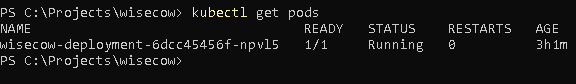
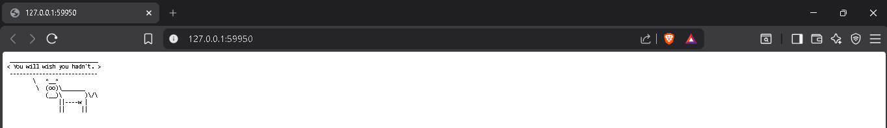
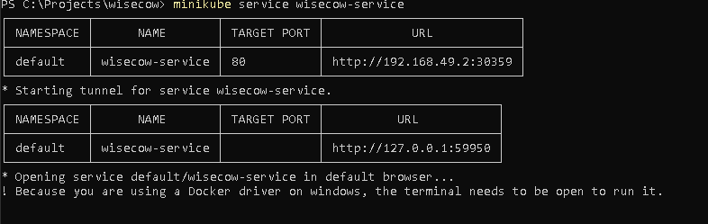
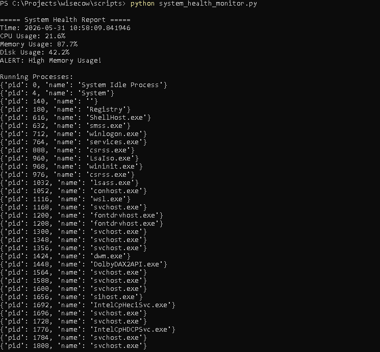
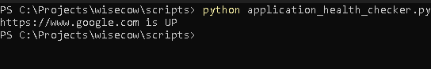

# Wisecow DevOps Project

## Project Overview

This project demonstrates containerization and deployment of the Wisecow application using Docker, Kubernetes (Minikube), and GitHub Actions CI/CD pipeline.

## Technologies Used

* Docker
* Kubernetes
* Minikube
* GitHub Actions
* Git
* Ubuntu

## Project Structure

```text
wisecow/
│
├── Dockerfile
├── wisecow.sh
├── README.md
│
├── k8s/
│   ├── deployment.yaml
│   └── service.yaml
│
└── .github/
    └── workflows/
        └── docker-build.yml
```

## Docker Setup

### Build Docker Image

```bash
docker build -t wisecow-app .
```

### Run Docker Container

```bash
docker run -d -p 4499:4499 --name wisecow-container wisecow-app
```

### Access Application

```text
http://localhost:4499
```

---

## Kubernetes Deployment

### Apply Deployment

```bash
kubectl apply -f k8s/deployment.yaml
```

### Apply Service

```bash
kubectl apply -f k8s/service.yaml
```

### Verify Pods

```bash
kubectl get pods
```

### Access Application via Minikube

```bash
minikube service wisecow-service
```

---

## CI/CD Pipeline

GitHub Actions workflow automatically:

* Triggers on push to main branch
* Builds Docker image
* Verifies successful build process

Workflow file:

```text
.github/workflows/docker-build.yml
```

---

## Features Implemented

* Dockerized Wisecow application
* Kubernetes deployment using Minikube
* Service exposure using NodePort
* GitHub Actions CI pipeline
* Public GitHub repository

---

## Screenshots

### Kubernetes Pods



### Application Browser Output



### GitHub Actions Successful Workflow


### Minikube Service Exposure




---

# Problem Statement 2 - Monitoring Scripts

## Scripts Implemented

### 1. System Health Monitoring Script

This Python script monitors:

* CPU usage
* Memory usage
* Disk usage
* Running processes

It generates alerts if resource usage exceeds predefined thresholds.

Script:

```text
scripts/system_health_monitor.py
```

---

### 2. Application Health Checker

This Python script checks whether a web application is UP or DOWN by sending HTTP requests and validating response status codes.

Script:

```text
scripts/application_health_checker.py
```

---

## Required Python Libraries

Install dependencies:

```bash
pip install psutil requests
```

---

## Run Scripts

### Run System Health Monitor

```bash
python scripts/system_health_monitor.py
```

### Run Application Health Checker

```bash
python scripts/application_health_checker.py
```
## Problem Statement 2 Screenshots

### System Health Monitoring Output



### Application Health Checker Output


